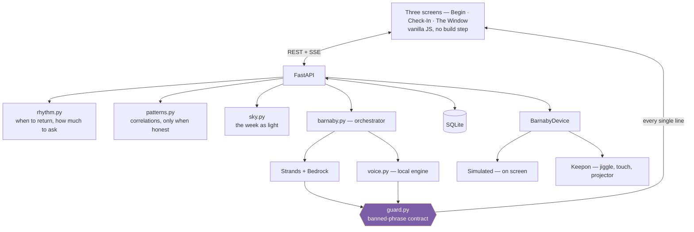

# 🃏 Gesture

### *A friendly jester. A friendly gesture.*

> **Feeling bugged out? Give a friendly gesture!**

A rhythm-based agent for neurodivergent people, people with dementia, and
anyone whose day keeps slipping through the gap between *knowing a thing needs
to happen* and *being able to do it.*

It does not optimise for output. It optimises for **self-knowledge.**

---

## The problem

Existing tools fail in one of two ways.

| | What it does | Why it misses |
|---|---|---|
| **Finch** and companion apps | Reward without scaffolding | Gamified self-care that never touches execution |
| **Calendars, reminders** | Notify you | A notification is a reminder that you forgot. It illuminates the gap; it doesn't bridge it |
| **Fabulous** | Behavioural science, genuinely aimed at the intention–action gap | Gets noisy. Loses neurodivergent users at the interface |
| **Tiimo** | Visual scheduling for ADHD | Good at time. Not at *being with you* |

None of them know the difference between **I forgot**, **I can't**, **I'm
scared of it**, and **I genuinely have no capacity today.** Those four look
identical from outside and need completely different responses.

Gesture is built around that distinction.

---

## Quickstart

```bash
python -m venv .venv && source .venv/bin/activate
pip install -r requirements.txt

python scripts/seed.py          # optional: a week of history so The Window has weather
python -m gesture               # http://127.0.0.1:8000
```

No credentials, no cloud account, no hardware. It runs offline out of the box.
`.env.example` documents the optional Bedrock integration.

Gesture uses your browser's timezone for the day boundary and check-in window.
The public Render instance is a shared, ephemeral demo: do not enter personal
or health information there.

```bash
pip install -r requirements-dev.txt
pytest        # 145 tests, including the design invariants
```

### Deploying

A Render blueprint is committed as [`render.yaml`](render.yaml) — push, then
**New → Blueprint** in the dashboard. It runs on the free plan.

Two things about that plan shape the config. The disk is **ephemeral**, so
every deploy wipes the database; `GESTURE_SEED_ON_EMPTY=1` therefore writes a
week of history behind today on a cold boot, so nobody lands on an empty
Window. It never overwrites real data, and it leaves today unbegun so the
visitor still meets the Begin screen first. And free instances **spin down**
after about fifteen minutes idle, taking 30–60s to wake — so open the link
yourself before you send it to anyone.

AWS credentials are optional there, as everywhere: without them Barnaby speaks
through the local voice engine, under the same contract.

---

## The three screens

### Begin
One screen, once a day. You set the shape: how much you have, when the day
starts and ends, and what's on it. The agent takes it from there.

Capacity maps to **balls in play** — at 15% you get one, at 90% you get five,
at zero Barnaby holds all of them and sits with you instead. Everything not in
play is **held**, which is not the same as dropped, deferred, or overdue.

> Spoon Theory is a loss model — you start with a number and they get used up.
> Barnaby's balls are a rest model. When you can't hold them, he does. For a
> brain that has been told it is lazy its whole life, the difference between
> *you have used up your resources* and *I'm holding these until you're ready*
> is the entire product.

### Check-In
Arrives on the agent's rhythm, not on a fixed timer. Mood, water, one optional
note — and an **Intentional Dismiss** that is always there, zero friction, zero
guilt.

**Dismiss is not failure. Dismiss is data.** Dismissing makes Barnaby come back
*later* and ask for *less*. Never sooner, never more.

### The Window
Your week as a sky that shifts from night to day. Hard weeks are 3am
blue-black. Good weeks are dawn threshold light. In-between weeks are magic
hour, where you genuinely cannot tell dusk from dawn.

You feel it before you read it. The numbers are underneath, for whenever you
want them.

---

## Two doors into the same house

The first thing Gesture ever asks:

> **How do you like to be talked to?**
> 🎪 *Give me the full show* — **Circus**
> 🤍 *Just talk to me plainly* — **Quiet**

Same philosophy, same banned phrases, same Barnaby. Circus is metaphor-rich and
kinetic. Quiet takes the costume off — clean, literal, direct, still warm.

This exists because personality-forward apps assume the persona is the feature.
For one kind of neurodivergent brain it is. For another it's a wall — the
abstraction is friction, and it has to be translated before it can help.
Gesture doesn't make you translate yourself to fit the app. The app asks who
you are first.

Quiet mode is **not** a lite version. It is a second front door.

---

## Three ideas this project actually argues for

### 1. The personality is enforced in code, not in a prompt

The seed doc lists phrases Barnaby must never say. Prompting a model to avoid
them is a wish. [`guard.py`](gesture/agent/guard.py) makes it a property of the
system: **every line of output**, whether it came from Bedrock or from a
hardcoded string, passes through the same contract before a human sees it.

```
"You really should get started before the deadline."   → blocked (obligation)
"It's super easy! Just sit down and focus."            → blocked (minimising)
"Why didn't you finish this yesterday?"                → blocked (interrogation)
"Let's optimize your workflow throughput."             → blocked (optimisation)
"Don't break the chain — 12 days in a row!"            → blocked (streaks)
```

A blocked line is discarded whole, not patched — a sentence built on the wrong
posture can't be repaired by deleting one word from it — and Barnaby falls back
to the local voice. The user never sees the difference.

This matters more than it looks. The person this is for has spent their life
being talked to in exactly these registers by people who meant well. One *"you
really should have started earlier"* undoes a week of trust. So it isn't a
style preference, it's a safety property, and it's [tested in both
directions](tests/test_guard.py) — the banned list fails, and Barnaby's own
canonical copy passes untouched.

### 2. Backing off is the agent's core behaviour

Every engagement product responds to being ignored by pushing harder. Gesture
does the opposite, and the asymmetry is pinned down by a test that will fail if
anyone ever reverses it:

```
dismissals in a row →   0     1     2     3     4
next check-in       →  60m   87m  114m  141m  168m
asks for            → full light feather feather feather
```

Weight walks *down* fast and *up* slowly — answering once after a hard stretch
gets you a `light` check-in, not the full questionnaire again. The reasoning is
inspectable in the UI: every factor, why it applied, and what it did.

### 3. The sky is drawn from how you felt, never from compliance

**Dismissals never darken The Window.** Neither do unfinished tasks.

If ignoring Barnaby made your sky go black, the picture would be a
participation grade with better art direction — and users would learn to
perform for it, which would poison the very data the agent adapts on. So light
comes from mood, sleep and water only. Dismissals live in the rhythm and in the
patterns, where they belong.

Two consequences fall out of taking that seriously:

- A day with no data is **unlit**, not dark. Absence renders as haze, with a
  dashed tick beneath it. A hard day and a day you didn't log are different
  things and collapsing them would be a lie told in gradient.
- A day where you dismissed everything leaves only last night's sleep behind.
  Averaged naively, the *worst day of the week renders as pleasantly average* —
  so days carry a **coverage** weight and thin days are drawn faintly and count
  less. Being unsure is rendered as being unsure.

---

## Barnaby

**The mascot:** a jester tardigrade — a water bear. Plump and segmented, slate
blue-grey, eight stubby clawed legs, big dark eyes, a white Pierrot ruff and a
purple three-lobe cap with gold bells. Genuinely delighted to see you, every
time.

A tardigrade is the right animal for this app on purpose. A water bear survives
the unsurvivable by curling into a *tun* — it dries out, goes dormant, waits out
the bad conditions, then rehydrates and carries on. That is the whole posture of
Gesture: a zero-capacity day is a tun, not a failure; held is not dropped; and
the water you log is the thing that brings him back.

**The role:** ringmaster, not mascot. He hands you only the acts you can
perform today and holds everything else himself.

**The jester logic:** the jester was the only figure in the court who could
tell the truth, because he wrapped it in something soft enough to land. Never
threatening. Always the smartest one in the room. For a brain that has been
told it's wrong its whole life by serious people in serious tones, a jester
gets through.

### The five acts

Sorted by what a thing *costs you*, not by when it's due — because for an
executive-dysfunctional brain those are wildly different numbers. "Reply to
Dad" and "reply to the landlord" are the same size on a calendar and nowhere
near the same size in a body.

| | Circus | Quiet | For |
|---|---|---|---|
| 🤹 | Juggling | Several small things | Context-switching is the whole job |
| 🔵 | Hoops | The hard one | A wall in front of it. You leap, you don't carry |
| ⚖️ | Balancing | The one that matters | Survival days. One thing, upright |
| 🎪 | Tightrope | Deep focus | One foot in front of the other |
| 🎭 | Trapeze | Letting go | Transitions. Barnaby catches what you drop |

Each act is headed by Barnaby performing it — juggling his striped balls, inside
a hoop, on the tightrope with a balance pole, gripping a trapeze bar, or just
standing steady for balancing. The poses are drawn as SVG (in `web/js/barnaby.js`,
reusing the same body as the companion), so they carry through from the act
picker on Begin to each in-play act on the day screen with no image files.

The live companion adopts them too: the big Barnaby on the day screen is *on*
whatever act he's working right now — the first one not yet done — and moves to
the next pose as you finish them, standing steady again once they're all done.
He keeps breathing, blinking, and jiggling throughout; the pose is just the
scene he's doing it in.

### The five stuck-states

Reachable from any screen, always: **I can't start · I lost the thread · I'm
scared of it · I've got nothing left · everything at once.**

Each gets a different response. *I can't start* takes the real task off the
table entirely and offers one physical five-second gesture requiring no
decisions. *I lost the thread* is answered from stored state, not from
imagination, because the whole value there is being **accurate** about where
you were.

### The curtain call

Not a report card. There is **no denominator anywhere in it** — "3 of 7" is a
grade wearing a progress bar, and [a test enforces its
absence](tests/test_api.py). Barnaby walks you through what actually happened,
weighted by what each thing cost you.

On a day where nothing got done:

> *You showed up. The tent is still standing. That counts.*

---

## Architecture



**Stack.** Python 3.11 · FastAPI · SQLite · AWS Strands Agents SDK
(Claude on Bedrock, or open models via Featherless) · vanilla JS with no
build step.

**Why no framework on the front end.** A judge clones this and runs two
commands. No npm, no bundler, no lockfile drift. The Window is a canvas and
Barnaby is inline SVG, which is all the toolchain either of them needs.

**Why SQLite.** One file, no server. Also: a neurodivergent user can delete one
file and have their data actually be gone.

**Two providers, one guard.** Barnaby speaks through the Strands SDK, through
either **Claude on Bedrock** or **open models on Featherless** (set by
`GESTURE_MODEL_PROVIDER`) — and through the *same* banned-phrase guard either
way. The guard catching drift from a Llama model with the same regex it uses on
Claude is the whole "personality enforced in code" claim made portable.

**Graceful degradation is the architecture, not a fallback.** When no provider
is reachable — no key, no credentials, a throttle — Barnaby speaks through the
local engine, held to the same contract, with no user-visible difference. A
presence that requires connectivity is not a presence, and a demo that dies
because a model throttled is a dead demo.

See [`docs/ARCHITECTURE.md`](docs/ARCHITECTURE.md) for the detail.

---

## Barnaby, the object

The physical Barnaby is a future concept: a hacked **My Keepon** with a
vibration motor, capacitive touch sensor, galaxy projector and handmade purple
jester collar. The repository includes an unvalidated firmware/protocol
prototype in [`hardware/`](hardware/barnaby_firmware.ino), but no physical unit
is part of this build or demo.

**Barnaby shakes until you pet him.** There is no timeout on the motor — a
jiggle that gives up on its own is a notification with extra steps. Coming back
into your body is the intervention, not the reminder.

For a brain that has been staring at a screen for three hours without noticing,
a phone notification is invisible. An object moving in peripheral vision is
not.

He has a bell on his collar — synthesised, no audio files — that rings once
when he starts shaking, and a softer descending chime when you pet him. That
second one is the important sound: it confirms the thing you actually did.

When you begin the day he plays the **overture**: *Entry of the Gladiators*
(Fučík, 1897, public domain) on a tinny little music box. The tent going up.
Quiet mode gets three rising notes instead — a morning, not a march.

The bell is **optional**, and its defaults are the sensory-safe ones: on in
Circus, off in Quiet, off for anyone with
`prefers-reduced-motion` set, and muted across every open tab the moment you
mute one. It rings on the *onset* of a jiggle and never loops — the shaking
has no timeout, and a bell that matched it would be unbearable.

The software does not depend on hardware: everything talks to `BarnabyDevice`,
and a future transport is one config flag. The on-screen Barnaby is a real
device, not a placeholder — it is the product.

---

## Hackathons

Gesture is entered in two events, built as one project:

- **Agents for Humans** · track **Good Neighbor Agents** — a population
  (neurodivergent users, people with dementia, executive dysfunction) that
  existing tech consistently fails.
- **Pixel Forge AI Hackathon** — apps/web where AI is a core part of the
  experience.

Same build, two framings; the compliance checklist and positioning for each are
in [`docs/HACKATHON.md`](docs/HACKATHON.md).

---

## License

MIT — see [`LICENSE`](LICENSE). Open source, do what you like with it.

---

## Origin

The design brief is lived experience rather than research — ADHD-C, BPD, PMDD,
likely autistic. That is not a small thing. It's the reason the banned-phrase
list is specific enough to be regex, and the reason "held, not dropped" was
worth building a whole data model around.

Emerged from a conversation with **Muneeba Brooks**, who is actively looking
for this tool and whose feedback produced Quiet mode.

*Rest is part of the performance. Even circuses have intermissions.*
